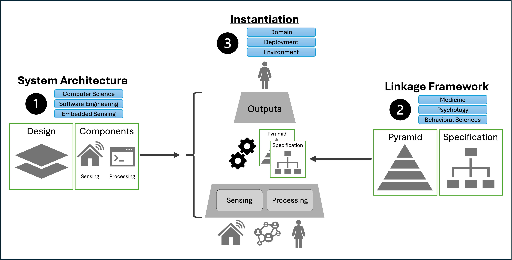
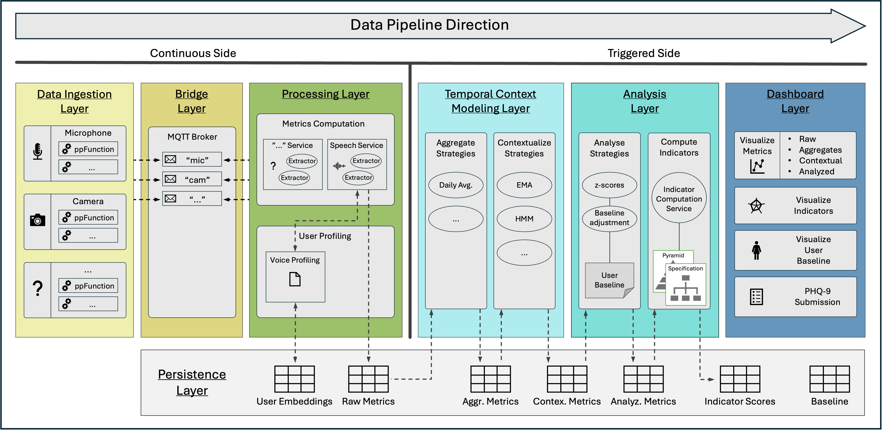

# Audio-centered Approach for Building a Multimodal Predictive AI Agent to Detect Depressive Behaviors

> This repository contains the applied work developed for my master's thesis in Computer Science at the [University of St. Gallen (HSG)](https://www.unisg.ch/de/).



## Motivation

> This master’s thesis introduces a novel approach for automated mental health monitoring. Particularly designed around an acoustic-based approach for depression detection, designed specifically as a software application for IoT-enabled private households. Using passive sensing techniques, the system focuses on the detection of potential depressive behavior to allow timely intervention. By constructing a direct mapping between behavioral patterns and observable clinical symptoms, users can gain insight into their mental health state, helping to overcome the limitations of traditional methods.

## Artifact

> The master thesis defines four distinct objectives for the goal of the work. This repository revolves around the practical application of the proposed conceptual artifacts. This implementation is a prototypical software system that combines the concrete Major Depressive Disorder (MDD) instantiation of the Linkage Framework and the designed System Architecture.

> -  Linkage Framework: At the center of this framework lies the structured relationship between high-level mental health disorders as defined in DSM-5 and the corresponding low-level biomarker data. In this way, an automated mental health diagnosis framework is proposed that promotes interpretability, uniformity, and interchangeability. Through this structured approach, future research on the exploration and investigation of biomarkers associated with DSM-5 disorders can be carried out uniformly and streamlined by facilitating knowledge transfer between different disorder mappings.

> -  System Architecture: The proposed System Architecture is a platform-based architectural design that supports modular development along a pre-defined data processing pipeline. The architecture promotes reusability, encapsulation of complexity, and independent integration of components. This strategy is particularly suited for multimodal, explainable health assessments in IoT sensing environments. Together with the Linkage Framework the System Architecture builds a system that promotes scientific collaboration and innovation in the field of automated mental health assessment methods.

## Data Pipeline Overview

The high-level data pipeline is illustrated below. Each step in the pipeline reflects a corresponding stage in the analysis of user data.



## Repository Overview

This repository is structured as follows:

-  analysis_layer: Reflects the "Analysis Layer" component on the data pipeline and is responsible for quantifying the feature-to-indicator mapping using the concrete employed [**`config.json`**](./analysis_layer/core/mapping/config.json) and the respective user baseline (initially: [**`population_baseline.json`**](./analysis_layer/core/baseline/population_baseline.json)).

-  dashboard_layer: Reflects the "Dashboard Layer" component on the data pipeline and is responsible for the user-system interaction and providing meaningful visualizations of the system output.

-  data_ingestion_layer: Reflects the "Data Ingestion Layer" component on the data pipeline and is responsible for setting up the sensor types and streaming the data to the system core.

   -  /framework/ – contains interfaces for uniform implementation of new sensor modalities. (user may not extend)
   -  /implementation/ - contains implemented sensor modalities. (user may extend)

-  datasets: Contains all data files that are possible to share, such as the Toronto Emotional Speech Set (TESS). Due to license agreements, the DAIC-WOZ speech set has to be kept hidden (in /ex_files/).

-  docs: Contains various scripts that have been used for creating visualizations or the evaluation of the master's thesis and miscellaneous additional resources such as data files and log-files.

-  playground: Experimental content that I like to keep in the repository for personal use.

-  processing_layer: Reflects the "Processing Layer" component on the data pipeline and employs two types of service groups: (1) metrics computation services, and (2) user profiling services.

-  temporal_context_modeling_layer: Reflects the "Temporal Context Modeling Layer" component on the data pipeline and is responsible for aggregating the raw metrics as well as contextualize them to make the sensed values more rigid and having them reflect the temporal notion as described in DSM-5.

## Services Overview

This is an overview of all services defined in the system and how to access them.

| Service Name                      | Container Name                    | Port  | URL / Notes                                    |
| --------------------------------- | --------------------------------- | ----- | ---------------------------------------------- |
| MQTT Broker                       | `mqtt`                            | 1883  | MQTT protocol only                             |
| MongoDB                           | `mongodb`                         | 27017 | MongoDB database                               |
| Mongo Express                     | `mongo-express`                   | 8081  | [http://localhost:8081](http://localhost:8081) |
| Voice Profiling Service           | `voice_profiling`                 | 8000  | [http://localhost:8000](http://localhost:8000) |
| Voice Metrics Service             | `voice_metrics`                   | –     | Internal only (no exposed port)                |
| Temporal Context Modeling Service | `temporal_context_modeling_layer` | 8082  | [http://localhost:8082](http://localhost:8082) |
| Analysis Layer                    | `analysis_layer`                  | 8083  | [http://localhost:8083](http://localhost:8083) |
| Dashboard Layer                   | `dashboard_layer`                 | 8084  | [http://localhost:8084](http://localhost:8084) |

## Quick Start

This quick tutorial introduces the core system functionality using the **`VoiceFromFile`** sensor type. This type let's you simulated audio input by streaming data from a `.wav` file.

---

#### 1. Build and start the system:

```bash
docker-compose up --build
```

#### 2. Stream audio from file

-  Navigate to file [**`./data_ingestion_layer/sense.py`**](./data_ingestion_layer/sense.py)

-  Define the filepath to the desired **`.wav`** file.

-  Run [**`./data_ingestion_layer/sense.py`**](./data_ingestion_layer/sense.py)

   ```bash
   python -u "./data_ingestion_layer/sense.py"
   ```

*  Wait until the whole file is processed, and the message "No data detected" is shown in the terminal.

#### 3. Analyze data

-  Open the **Streamlit dashboard** at [`http://localhost:8084`](http://localhost:8084).

-  Select the first user on the left side via the dropdown list.

-  Click "Refresh Analysis" button to trigger the data analysis.
